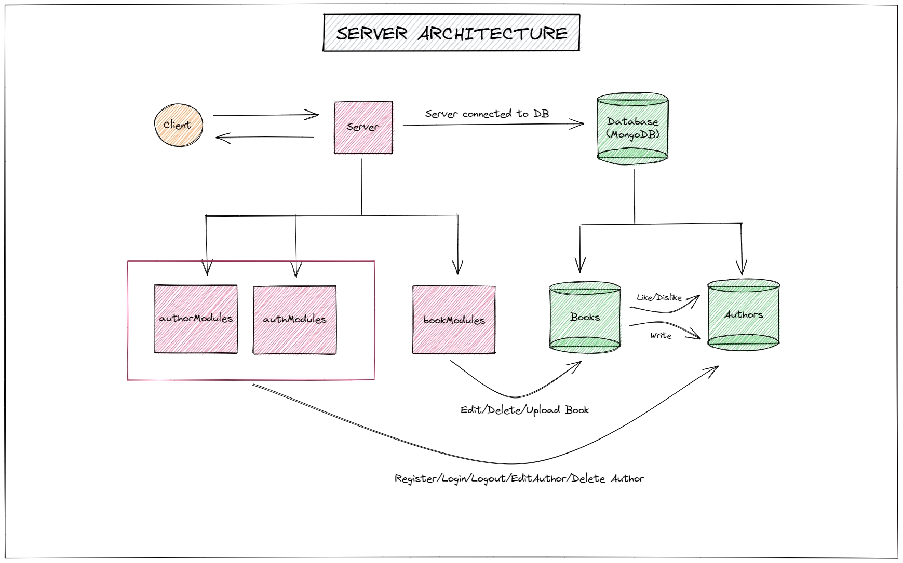

# Backend Assignment: Pet Perfect🧑‍💻🚀

### Assignment Link🔗: https://bit.ly/3trGNvh

### Server Architecture Diagram:
</img>
🔗: https://excalidraw.com/#json=tLZba9IIqwQdaudz1I_Mk,JoaBloWOAx4dE1dLc3k6IA


## Run the API 
- Create a new MongoDB cluster and insert the example env file's URL into it.
- Change the name of example env to.env.
- Now, use the provided instructions to launch the API.

```
npm install
npm start
```

- When the server starts/restarts, 10 random authors and several book entries for each author will be produced automatically using "Faker.js".
- The randomly created accounts default password is "password".
